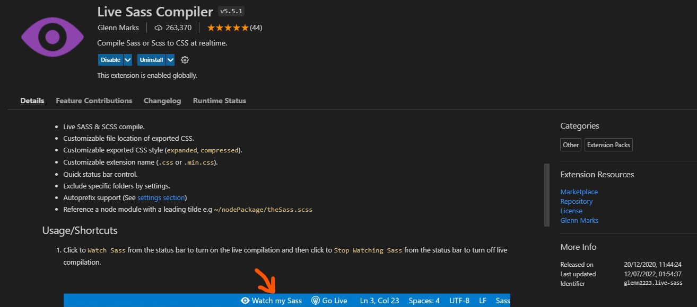

# Sass-.scss-
<h2> Sass Concepts </h2>
<ul>
  <li> Sass is also known as Sassy CSS.</li>
   <li> It is a CSS PreProcessor/Extension </li>
   <li> Browser doesn't read Sass files directly, it has to be compiled to regular CSS
     Easier to read and write than CSS custom properties </li>

</ul>
<h3>NPM Install Sass</h3>

`npm install -g sass`
<h3>Useful Resources</h3>

Documentation for [SASS](https://sass-lang.com/)

Practise Sass, by converting Sass into css [Sass-into-css](https://www.sassmeister.com/)

